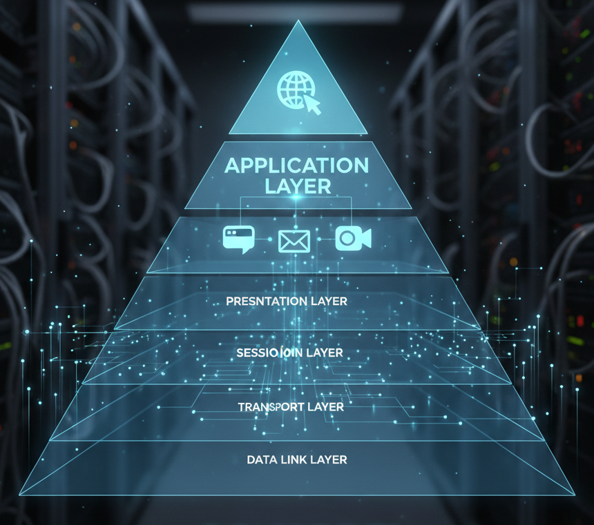

# Application Layer (Layer 7)

  

The **Application Layer** is the **7th and topmost layer** of the OSI model.  
It is directly closest to the end-users, providing **network services to applications** and enabling communication between software and the underlying network.  

This layer does not handle how data is transported; instead, it provides **interfaces and services** that allow users and applications to access the network.

---

## Primary Functions

### 1. Network Virtual Terminal (NVT)
- Provides a **standard interface** for remote login and communication.  
- **Example:** Telnet allows a user to log into a remote computer.  
- **Purpose:** Ensures applications can communicate even if different systems are used.  

### 2. Resource Sharing and File Transfer
- Enables **file access, retrieval, and management** across the network.  
- **Protocols:** FTP, TFTP, NFS  
- **Example:** Transferring files between a client and a server.  

### 3. Mail Services
- Provides the facility for **email communication**.  
- **Protocols:** SMTP, POP3, IMAP  
- **Example:** Sending and receiving emails via Outlook or Gmail.  

### 4. Directory Services
- Provides **centralized directory information and lookup**.  
- **Protocols:** DNS, LDAP  
- **Example:** Converting a domain name (`www.google.com`) into an IP address.  

### 5. Network Management & Communication Support
- Supports **messaging, data exchange, and collaboration** between users.  
- **Protocols:** SNMP, XMPP, HTTP, HTTPS  
- **Example:** Managing routers using SNMP or browsing the internet using HTTP/HTTPS.  

---

## Common Protocols at Application Layer
- **HTTP/HTTPS** → Web browsing  
- **SMTP/POP3/IMAP** → Email services  
- **DNS** → Domain name resolution  
- **FTP/TFTP** → File transfer  
- **SNMP** → Network management  
- **Telnet/SSH** → Remote login  

---

## Real-World Examples
- **Web Browsing:** Chrome/Firefox using HTTP/HTTPS  
- **Email Communication:** Gmail/Outlook with SMTP, POP3, IMAP  
- **File Sharing:** Uploading/downloading files via FTP  
- **Video Conferencing:** Zoom, Teams (application services over HTTP/SIP)  
- **Domain Resolution:** DNS translating `google.com` into IP address  

---

## Layer Interactions
- **Receives from:** Users and applications (real-world interaction)  
- **Sends to:** Presentation Layer (data formatting, encryption, compression)  

---

##  In Short
The **Application Layer** is where **users, applications, and network services meet**.  
It provides the actual services people use (**web, email, file transfer, etc.**) and relies on lower layers to handle transmission.  
