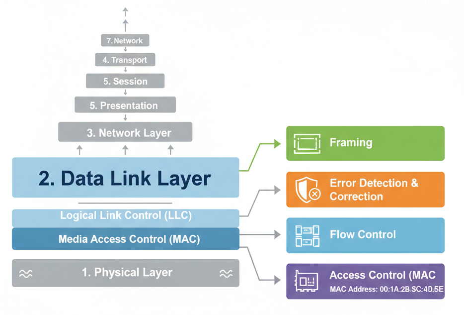

# Data Link Layer

  

The Data Link Layer acts as a **reliable mail service between two directly connected neighbors**.  
Just like a postal worker ensures your letter gets from your house to your neighbor’s house without damage, the Data Link Layer ensures data is transferred **from one network device to the next without errors**.

---

## Main Functions
The Data Link Layer is divided into two sublayers:

### 1. Data Link Control (DLC)
- **Framing** – Packaging data properly  
- **Flow Control** – Managing the speed of data transfer  
- **Error Control** – Detecting and fixing mistakes  

### 2. Media Access Control (MAC)
- **Sharing the network** – Deciding who can send data when  
- **Physical addressing** – Using MAC addresses to identify devices  

---

## Framing: Packaging Your Data
### What is Framing?
Like sending a letter:
1. Put it in an envelope (frame)  
2. Write the address clearly  
3. Add a return address  

 Framing packages data so the receiver knows **where one message starts and ends**.

### Types of Framing
1. **Character Count**  
   - Specifies frame length  
   - Problem: If the count is corrupted, the frame breaks  

2. **Flag Byte with Byte Stuffing**  
   - Special symbols mark start and end  
   - If the symbol appears in the data, an escape character is added  

3. **Start/End Flag with Bit Stuffing**  
   - Special bit pattern `01111110` as flag  
   - Insert a `0` after five consecutive `1`s in data  

4. **Physical Layer Coding Violation**  
   - Uses unusual electrical signals to mark boundaries  

### Framing Approaches
- **Bit-Oriented Framing** – Data as a stream of bits  
  - Example Protocol: **HDLC**  
- **Byte-Oriented Framing** – Data as groups of bytes  
  - Example Protocols: **PPP, BISYNC**

---

## Error Control: Catching and Fixing Mistakes
### Why Do We Need It?
Data corruption can occur due to:
- Electrical interference  
- Physical cable damage  
- Wireless interference  

### Types of Errors
- **Single-bit Error** – One bit flips (e.g., `00000010 → 00001010`)  
- **Burst Error** – Multiple consecutive bits corrupted (more common)  

### Error Detection Methods
1. **Block Coding**  
   - Adds redundant bits to detect invalid patterns  

2. **Hamming Distance**  
   - Measures bit differences between codewords  
   - Rule: To detect `s` errors → need Hamming distance `s + 1`  

3. **Cyclic Redundancy Check (CRC)**  
   - Uses polynomial division for a “mathematical fingerprint”  
   - Detects most burst errors effectively  

4. **Checksum**  
   - Sender adds data values → sends total  
   - Receiver verifies by re-adding  
   - Limitation: May miss some even-numbered errors  

5. **Internet Checksum**  
   - Divides data into 16-bit words  
   - Adds them using one’s complement arithmetic  
   - Receiver checks if final sum = `0`  

---

## Flow Control: Managing Traffic
- Prevents **fast senders** from overwhelming **slow receivers**  
- Works like **traffic lights** controlling road traffic  

**Example:**  
Sender speed = **1 Gbps**  
Receiver speed = **100 Mbps**  
→ Flow control slows down sender or buffers data  

---
