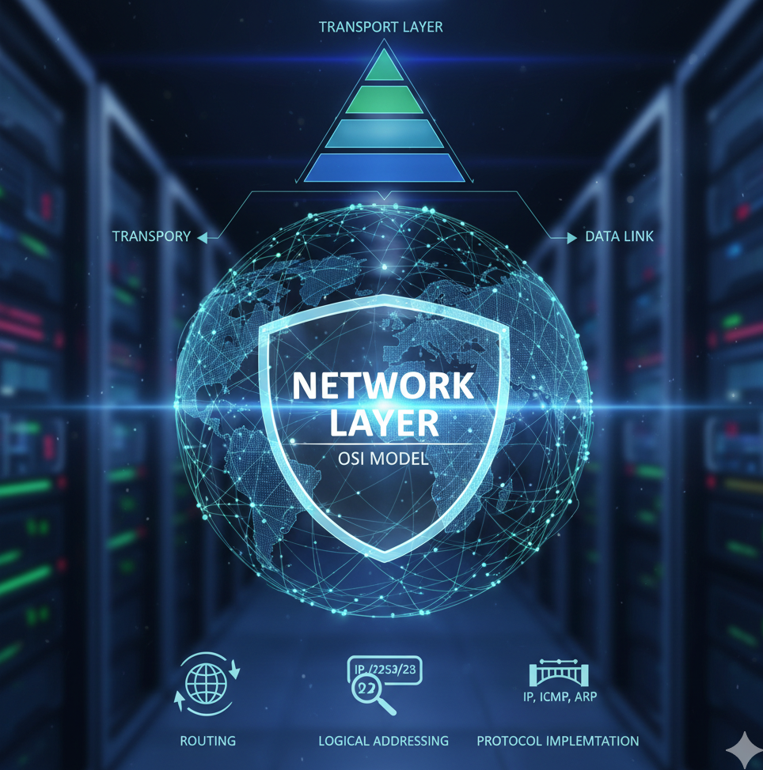

# Network Layer 

  

The **Network Layer** is the **third layer of the OSI model**.  
Its main responsibility is to ensure that data can be transferred from the **source device to the destination device across multiple networks**.  

- The **Data Link Layer** only handles communication between devices in the same network (e.g., two computers in a LAN).  
- The **Network Layer** handles communication between devices that may be on **different networks**, possibly separated by many routers.  

---

## Services of the Network Layer

1. **Logical Addressing**  
   - Every device on the network must have a unique logical address (e.g., IP address).  
   - Unlike physical addresses (MAC addresses), logical addresses are hierarchical and help identify both the **network** and the **host**.  

2. **Routing**  
   - Process of selecting the best path for data to travel from source to destination.  
   - **Routers** operate at this layer, using routing algorithms and tables to forward packets efficiently.  

3. **Packet Switching**  
   - Data is divided into packets at this layer.  
   - Each packet can take a different path to the destination, where they are reassembled.  
   - Increases network reliability and efficiency.  

4. **Fragmentation and Reassembly**  
   - If a packet is too large for the underlying network, it is broken into smaller fragments.  
   - At the receiver’s end, fragments are reassembled into the original packet.  

5. **Error Handling and Diagnostics**  
   - Provides error reporting mechanisms (e.g., ICMP in IP networks).  
   - Supports diagnostics like **ping** to test connectivity.  

---

## Functions of the Network Layer

- **Addressing** → Assigns logical addresses to devices.  
- **Routing** → Determines the path based on network conditions, topology, and routing algorithms.  
- **Encapsulation** → Data from the Transport Layer is encapsulated into packets with headers (containing logical addresses and control info).  
- **Decapsulation** → At the receiver, headers are removed and data is passed to the Transport Layer.  

---

## Network Layer Devices

- **Routers** → Forward packets between different networks.  
- **Layer 3 Switches** → Provide routing within large LANs.  
- **Gateways** → Connect networks that use different protocols.  

---

## Protocols at the Network Layer

- **IP (Internet Protocol)**  
  - IPv4 → 32-bit addresses.  
  - IPv6 → 128-bit addresses, supports more devices and better security.  

- **ICMP (Internet Control Message Protocol)** → Error reporting and diagnostics (e.g., *ping*).  

- **ARP (Address Resolution Protocol)** → Maps IP addresses to MAC addresses.  

- **RARP (Reverse ARP)** → Maps MAC addresses to IP addresses.  

- **Routing Protocols**  
  - RIP (Routing Information Protocol)  
  - OSPF (Open Shortest Path First)  
  - BGP (Border Gateway Protocol)  

---

## Types of Switching Used

1. **Circuit Switching**  
   - Dedicated communication path established before transmission.  
   - Example: Traditional telephone systems.  
   - Rarely used in modern data networks.  

2. **Packet Switching**  
   - Data split into packets, each packet travels independently.  
   - **Basis of the Internet.**  

3. **Message Switching**  
   - Entire message stored and forwarded at intermediate nodes.  
   - Slower, mostly obsolete.  

---

## Example

When a message is sent from one computer to another in a different network:

1. The Transport Layer passes the data to the Network Layer.  
2. The Network Layer **encapsulates** it into packets with source and destination IP addresses.  
3. Using **routing**, the best path is chosen.  
4. If packets are too large, **fragmentation** occurs.  
5. Packets travel across routers using **packet switching**.  
6. At the receiver:  
   - Packets are **reassembled** if fragmented.  
   - The Network Layer **decapsulates** the header.  
   - Data is passed to the Transport Layer.  

---
