# Networking Concepts

## 1. Network Devices

### NIC (Network Interface Card)

  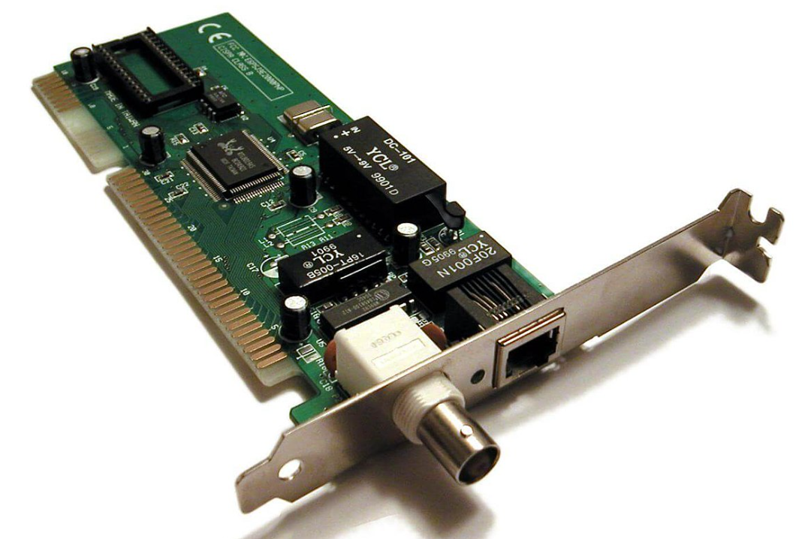

- Connects host devices (computers, printers, etc.) to the network.  
- A circuit board that fits into a computer’s motherboard.  
- Also called a **network adapter**.  
- Each NIC has a **unique MAC address** used for communication.  

### Repeater

  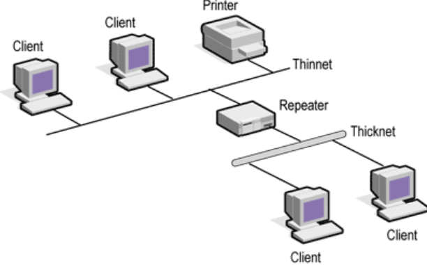

- Regenerates signals that weaken due to distance (**attenuation**).  
- Works with both analog and digital signals.  
- Does not make intelligent forwarding decisions.  

### Hub

  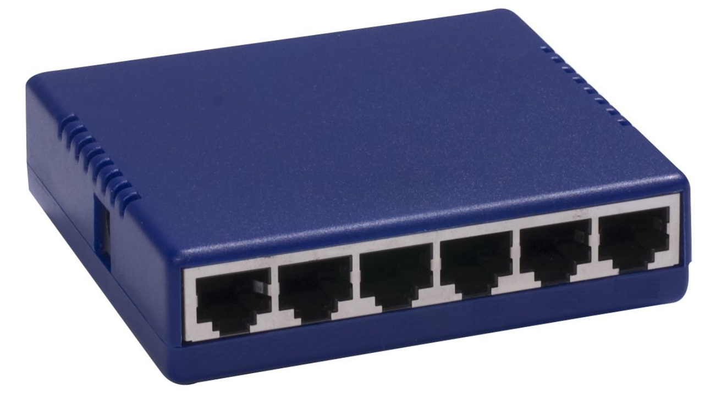

- Concentrates multiple connections and treats them as a single network.  
- **Passive hub**: Just connects devices.  
- **Active hub**: Connects and regenerates signals.  

### Bridge

  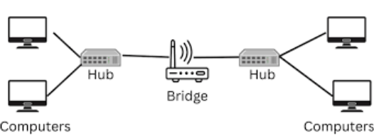

- Works at the **Data Link Layer (Layer 2)**.  
- Connects two LANs that use the same protocol.  
- Reads **MAC addresses** to filter and forward data.  
- Has 2 ports (input & output).  

### Switch

  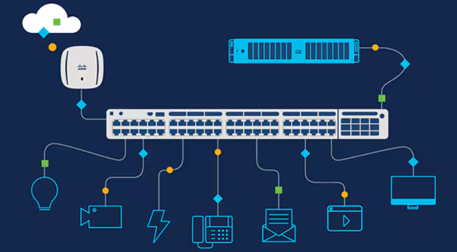

- Smarter than a hub/bridge.  
- Forwards data only to the intended device.  
- Multi-port bridge with buffering for better efficiency.  
- Operates at the **Data Link Layer (Layer 2)**.  
- Can perform **error checking** before forwarding.  

### Router

  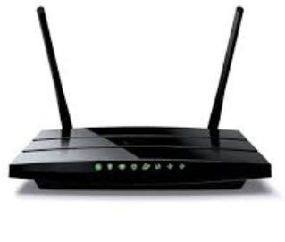

- Operates at the **Network Layer (Layer 3)**.  
- Receives, analyzes, and forwards packets between networks (LAN/WAN).  
- Stores routing tables and forwards data based on destination addresses.  

### Gateway

  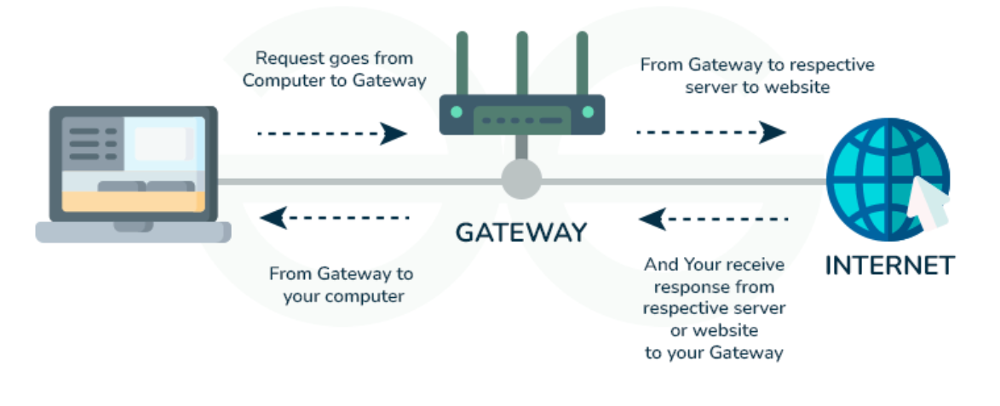

- Connects networks using **different protocols**.  
- Operates up to the **Session Layer (Layer 5)**.  
- Differentiates between inside and outside networks.  

### Firewall

  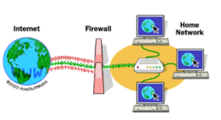

- A device/software that enforces **security rules**.  
- Controls traffic between internal and external networks.  
- Blocks unrecognized requests, allows trusted ones.  

---

## 2. Network Types

### PAN (Personal Area Network)
- Small range, usually **home-based**.  
- Connects personal devices like computers, printers, and phones (wired or wireless).  
- Used for sharing documents, internet access, entertainment.  

### LAN (Local Area Network)
- Connects devices within a **building or campus**.  
- Uses hubs, switches, adapters, cables, or wireless access points.  
- Can be divided into **VLANs (Virtual LANs)**.  

### MAN (Metropolitan Area Network)
- Covers a **city or large campus**.  
- Connects multiple LANs via telephone lines or fiber.  
- Protocols: **RS-232, Frame Relay, ATM, ISDN**.  
- Examples: **bank communication, airline reservation systems, military**.  

### WAN (Wide Area Network)
- Covers a **country or worldwide** (largest scale).  
- Uses telephone lines, fiber optic cables, or satellites.  
- The **Internet** is the largest WAN.  
- Used in **business, government, education, and global communication**.  

---

## 3. Network Topologies

### Bus Topology

  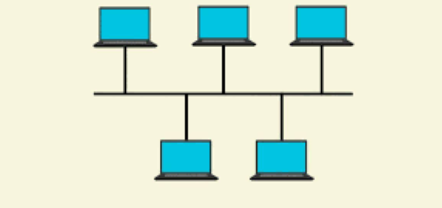

- All devices share a **single communication line**.  
- Simple and cost-effective.  
- Failure of the main line disrupts the whole network.  

### Star Topology

  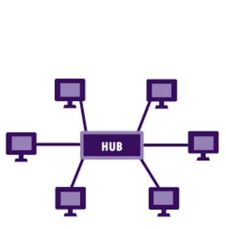

- All devices connect to a **central hub/switch/router**.  
- Easy to manage and expand.  
- Failure of central device disrupts communication.  

### Ring Topology

  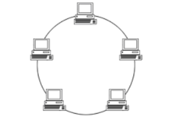

- Each device connects to **two others**, forming a loop.  
- Data passes through intermediate devices until it reaches the destination.  

### Mesh Topology

  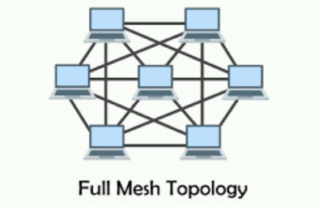

- Devices are connected **point-to-point**.  
- **Full Mesh**: Every device connects to every other device (high reliability).  
- **Partial Mesh**: Some devices are directly connected.  

### Tree / Hierarchical Topology

  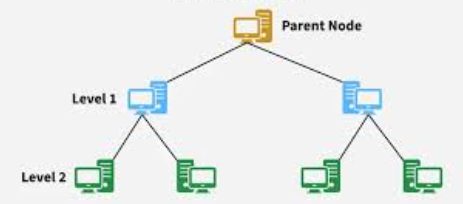

- Devices arranged in **hierarchical levels** with a root node.  
- Combines features of bus and star.  
- Good for grouped workstations.  

### Hybrid Topology

  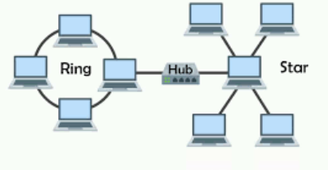

- Combination of two or more topologies (e.g., Star + Ring).  
- Inherits advantages and disadvantages of the combined topologies.  
- A mesh topology requires "N*(N-1)/2" number 
of duplex-mode connections for N devices in 
a network.
