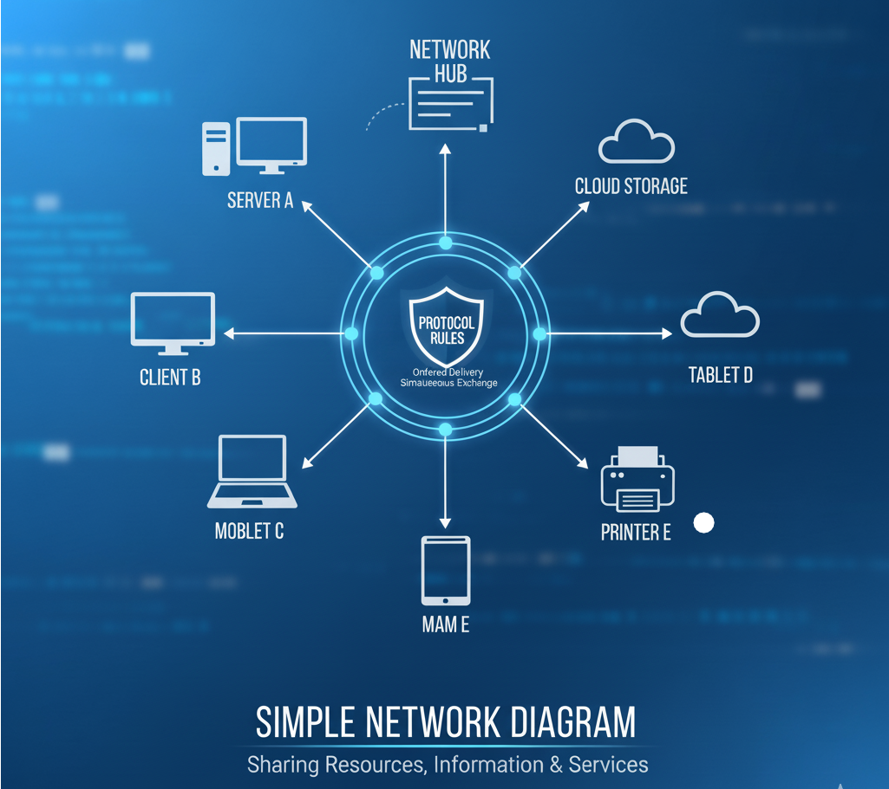
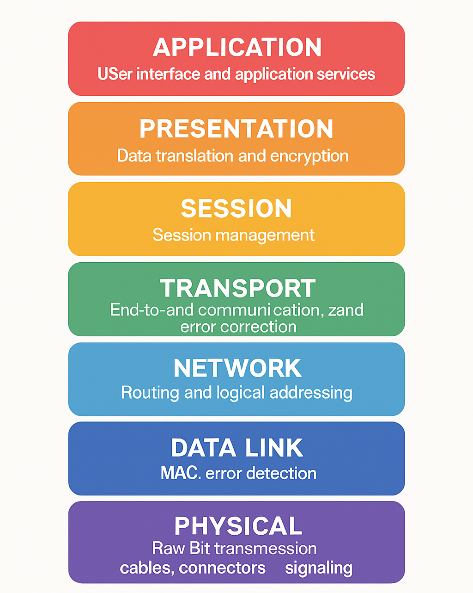
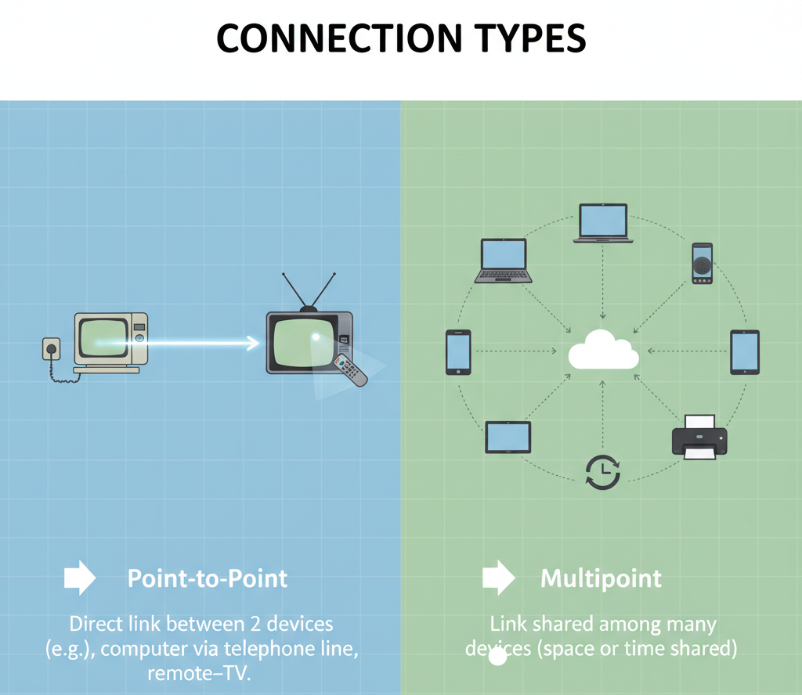
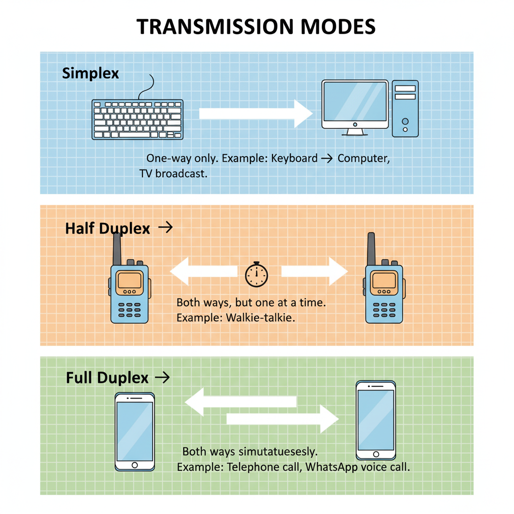
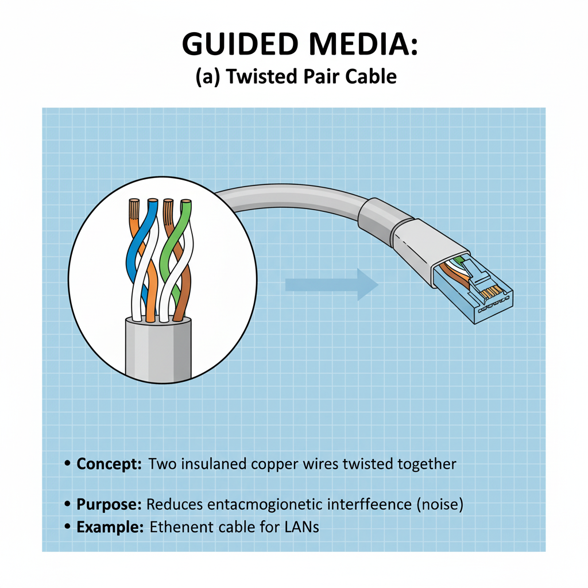
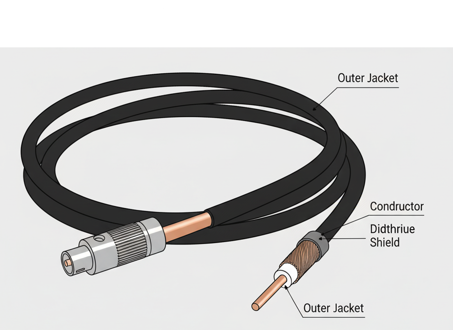
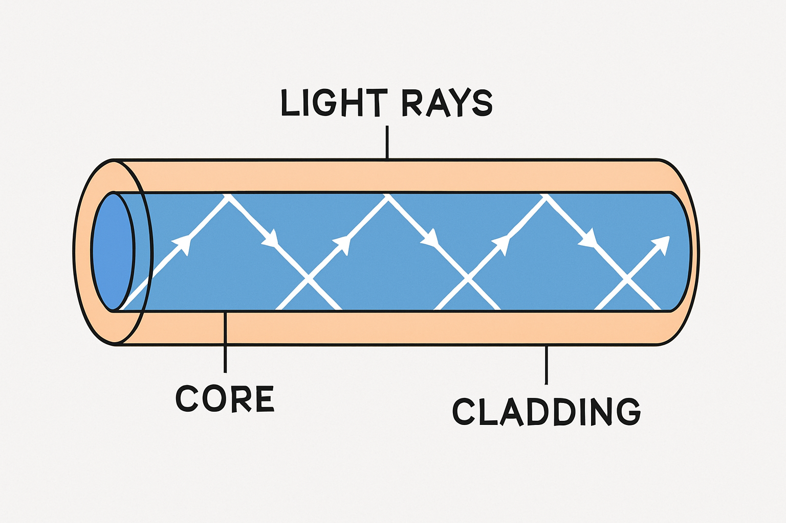

# What is a Network?

  

A **network** refers to a system of interconnected elements that are linked together in order to share resources, exchange information, and services.  

During sharing in networks, it is important to follow rules that we call **“Protocol”** to ensure proper sharing (e.g., messages should reach the receiver in the same order and at the same time).  

To implement these protocols, the **International Organization for Standardization (ISO)** in **1984** developed the **OSI model (Open System Interconnection)**.

---

## Layer of OSI Model

  

The OSI model has 7 layers: the Physical layer handles raw bit transmission over cables or signals, the Data Link layer manages error detection and framing, the Network layer deals with addressing and routing, the Transport layer ensures reliable end-to-end delivery, the Session layer manages sessions between devices, the Presentation layer translates, encrypts, and compresses data, and the Application layer provides network services directly to the user like email, web browsing, and file transfer.

---

## 1. Connection Types

  

- **Point-to-Point**  
  Direct link between 2 devices.  
  *Example:* Computer via telephone line, Remote → TV.  

- **Multipoint**  
  Link shared among many devices (space or time shared).  
  *Example:* Bus topology in LAN.  

---

## 2. Transmission

  

**Definition:** Method of transferring data between devices across a network.  
Ensures communication by defining the **direction of data flow**.  

### Transmission Modes

- **Simplex**  
  - One-way communication only.  
  - Used when feedback is not required.  
  - *Example:* Keyboard → Computer, TV broadcast.  

- **Half Duplex**  
  - Both devices can send and receive, but only one at a time.  
  - Saves cost, but communication is slower than full duplex.  
  - *Example:* Walkie-talkies, Police radio.  

- **Full Duplex**  
  - Devices can send and receive data at the same time.  
  - Increases efficiency, requires better hardware.  
  - *Example:* Telephone calls, Zoom/WhatsApp calls.  

---

## 3. Transmission Media

- **Definition:** Medium that carries data signals from one device to another.  
- **Function:** Transfers data in **LANs and WANs**.  

### Types:
- **Guided (Wired)** → Physical cables like *Twisted Pair, Coaxial, Fiber Optic*.  
- **Unguided (Wireless)** → Uses air as medium: *Radio waves, Microwaves, Infrared*.  

---

## 4. Guided Media (Wired Communication)

### (a) Twisted Pair Cable

  

- Made of two copper wires twisted in a helix form to reduce electromagnetic interference (EMI).  
- Cheap, lightweight, and easy to install, but limited bandwidth.  
- *Examples:* Home internet cables, office LANs.  

---

### (b) Coaxial Cable

  

- Contains a central copper core, insulating layer, and metallic shield to prevent EMI.  
- Supports high-frequency signals and provides better performance than twisted pair.  

**Advantages:**  
- High bandwidth  
- Better shielding  
- Reliable  

**Disadvantages:**  
- More expensive  
- Single cable fault can crash the entire network  

*Examples:* Cable TV connections, CCTV wiring.  

---

### (c) Fiber Optic Cable

  

- Uses **light pulses** to transmit data at very high speed.  
- Immune to electromagnetic interference and supports long-distance communication.  

**Advantages:**  
- Very high speed  
- Huge bandwidth  
- Works over long distances  

**Disadvantages:**  
- Expensive  
- Delicate  
- Difficult to install/maintain  

*Examples:* Internet backbone, submarine cables, **Jio Fiber / Airtel Xstream** broadband.  

---
