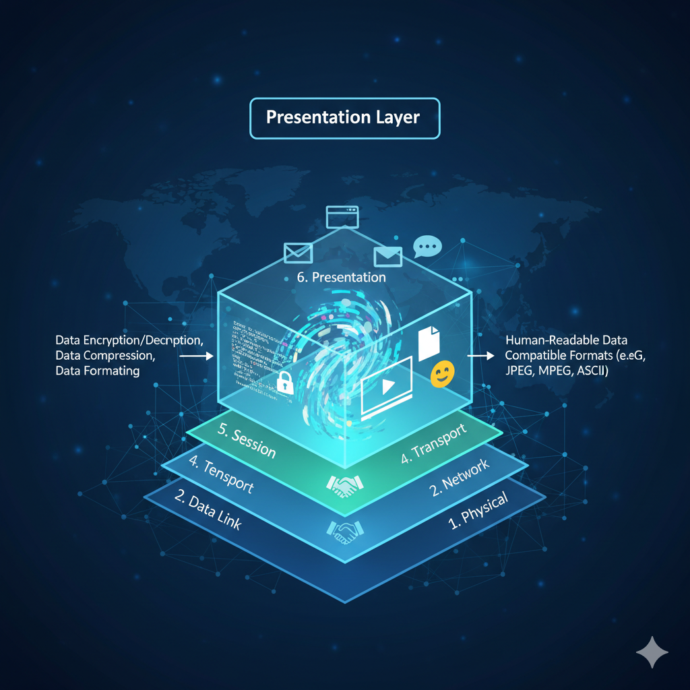

# Presentation Layer (Layer 6) 

  

The **Presentation Layer** is the **6th layer of the OSI model**, responsible for preparing data for the Application Layer.  
It ensures data is **compatible, efficient, and secure** for communication between different systems.

The Presentation Layer handles three main functions:  

1. **Data Translation**  
2. **Data Compression**  
3. **Data Encryption/Decryption**  

It ensures data compatibility between systems and provides **security and efficiency**.

---

## Primary Functions

### 1. Data Translation
- **Sending Process:** Converts application data into network-compatible format.  
- **Receiving Process:** Converts network data back into application format.  
- **Character Set Conversion:** Handles different encoding schemes (ASCII, EBCDIC, Unicode).  

**Purpose:** Ensures compatibility between different systems.

---

### 2. Data Compression
- **Lossless:** Preserves all data (e.g., ZIP, GZIP).  
- **Lossy:** Acceptable loss of data for smaller file size (e.g., JPEG, MP3).  

**Goal:** Reduce data size for faster transmission.  
**Example:** "25.888888888" compressed to "25.8".

---

### 3. Encryption and Decryption
- **Encryption:** Converts plaintext into unreadable format using algorithms and keys.  
- **Decryption:** Converts encrypted data back into readable format.  
- **Types:**  
  - Symmetric: Same key for encryption and decryption.  
  - Asymmetric: Different keys for encryption and decryption.  

**Purpose:** Ensures **data security** during transmission.

---

## Common Data Formats
- **Character Encoding:** ASCII, EBCDIC, Unicode  
- **Media Formats:** JPEG, GIF, MPEG, MP3, PDF  
- **Protocols:** SSL/TLS, MIME  

---

## Real-World Examples
- **Web Browsing:** HTTPS encryption, GZIP compression  
- **Email:** MIME encoding for attachments  
- **Streaming:** Video compression, DRM encryption  

---

## Layer Interactions
- **Receives from:** Application Layer (raw data)  
- **Sends to:** Session Layer (processed data)  

**Benefit:** Applications don’t need to worry about format compatibility.
