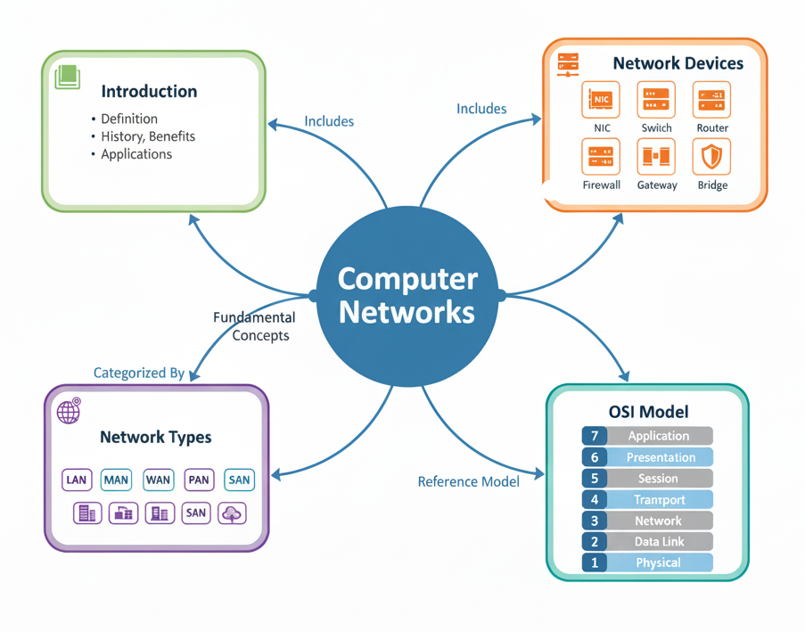

# Computer Networks Repository

<p align="center">
  
</p>


This repository provides a structured and comprehensive study material on **Computer Networks**. It is designed to cover both the theoretical concepts and their practical relevance. The content is organized into separate markdown files for clarity, making it easier for learners to navigate and focus on one topic at a time.  

Computer Networks form the backbone of modern communication systems, enabling data exchange, resource sharing, and connectivity across the globe. This repository explains the basics of networks, their devices, types, and a detailed breakdown of the **OSI (Open Systems Interconnection) Model**, which is fundamental to understanding how communication works in layered architectures.

---

## Repository Structure

- **Introduction**
  - [`Introduction`](./Networks-Doc/Networks-Introduction.md) – Provides a foundation for computer networks, their evolution, importance in modern computing, and applications in daily life.

- **Network Devices**
  - [`Network_devices`](./Networks-Doc/Networking-Concepts.md) – Explains hardware components such as NIC, Hub, Switch, Bridge, Router, Gateway, Repeater, and Firewall, along with various types of networks such as LAN, MAN, WAN and Network topologies.

- **OSI Model**
  - [`Physical_layer`](./Networks-Doc/Physical-Layer.md) – Responsible for the physical transmission of raw bits, signals, and performance metrics.
  - [`Data_link_layer`](./data_link_layer.md) – Focuses on framing, addressing, and error control at the data link level.
  - [`Network_layer`](./network_layer.md) – Manages logical addressing, routing, and packet forwarding.
  - [`Transport_layer`](./transport_layer.md) – Ensures reliable end-to-end delivery, sequencing, and flow control.
  - [`Session_layer`](./session_layer.md) – Establishes, manages, and terminates sessions between communicating systems.
  - [`Presentation_layer`](./presentation_layer.md) – Handles data translation, encryption, and compression for proper delivery.
  - [`Application_layer`](./application_layer.md) – Provides services and interfaces for user applications such as web browsing, file transfer, and email.

---

## Objectives

The main objectives of this repository are:
- To provide a **well-structured learning resource** for students, educators, and professionals interested in computer networks.
- To break down complex concepts into **easy-to-understand modules** with clear explanations.
- To document the **OSI Model layers individually**, highlighting their responsibilities, protocols, and interactions.
- To serve as a **reference guide** for academic preparation, interviews, or technical assessments.
- To create a collaborative platform where learners and contributors can share and expand networking knowledge.

---


## Usage

1. Clone the repository:
   ```bash
   git clone https://github.com/your-username/computer-networks.git
